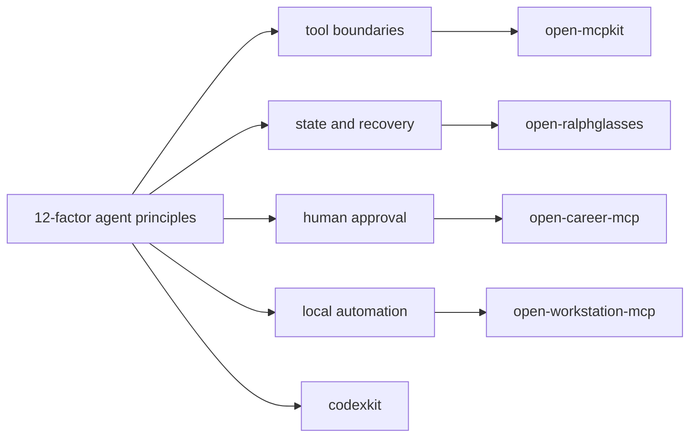

# Portfolio Context Notes

This fork is related context, not primary implementation proof. It is useful because it frames reliable agent systems as ordinary software with explicit prompts, context, state, control flow, error handling, and human contact points.

## Why This Matters

- It gives vocabulary for discussing production agent systems without overclaiming framework magic.
- Factors such as owning context, unifying state, launch/pause/resume, compact errors, and stateless reducers map directly to durable AI infrastructure design.
- The repo is strongest as public reading material and interview context. First-party implementation proof should still come from the smaller public-safe Go repos.

## Mapping To Implementation Proof

| Principle area | Related factor | Public implementation repo |
| --- | --- | --- |
| Tool boundaries | Factors 1 and 4 | `open-mcpkit` |
| Execution state and recovery | Factors 5, 6, and 12 | `open-ralphglasses` |
| Human approval boundaries | Factor 7 | `open-career-mcp`, `open-mcpkit` |
| Control flow and focused agents | Factors 8 and 10 | `open-ralphglasses`, `codexkit` |
| Error compaction and reviewable output | Factor 9 | `open-mcpkit`, `open-workstation-mcp` |
| Triggers and local automation surfaces | Factor 11 | `open-workstation-mcp` |

## Reviewer Path

No build is required for portfolio review. Use this read order:

1. Read the fork/context callout at the top of `README.md`.
2. Read the short factor list in `README.md`.
3. Read factors 3, 4, 5, 6, 7, 8, 9, and 12 for the strongest overlap with production agent infrastructure.
4. Compare those principles with the concrete public-safe repos listed above.
5. Treat this repo as related context, not a claim of first-party implementation depth.

## Context Diagram



## Public Framing

Good public framing:

```text
Related context: 12-factor-agents provides useful production-agent vocabulary around context, state, human approval, control flow, and error handling.
```

Avoid this framing:

```text
Primary implementation proof for my agent platform work.
```

## Interview Deep-Dive Prompts

- Which factors matter most when an agent runs for hours instead of a single request?
- How do structured tool calls and stateless reducers change incident recovery?
- Where should human approval fit in an otherwise automated workflow?
